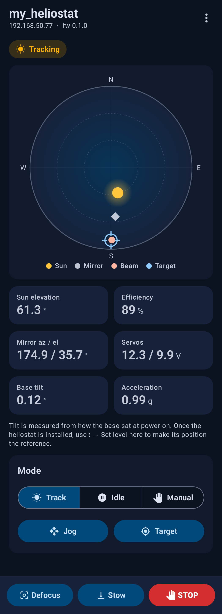
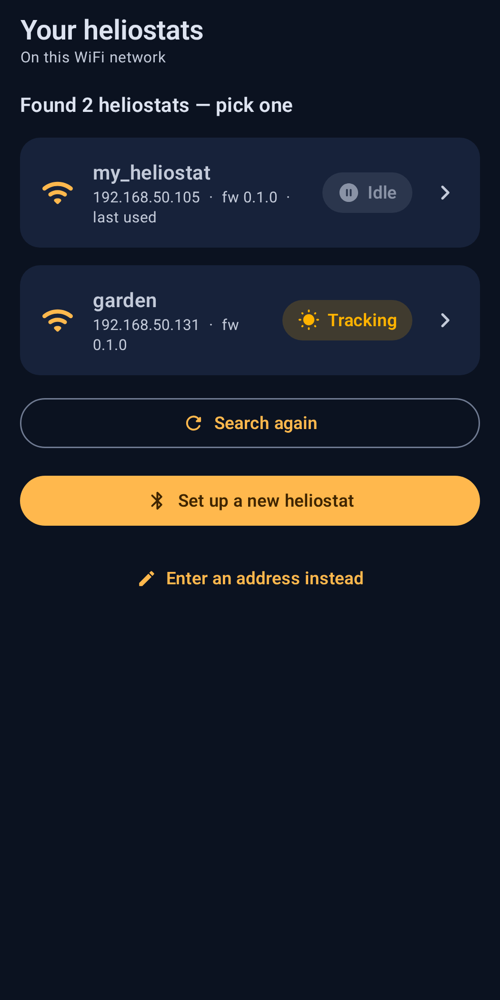
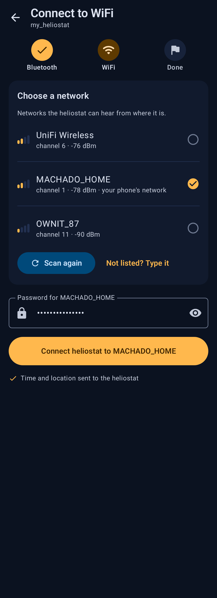
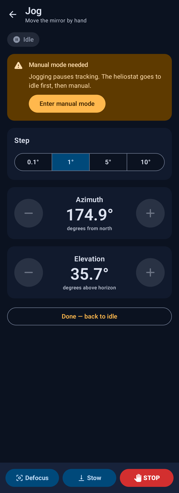

# Heliostat app

The Android app for **[heliostat](https://github.com/machadothi/heliostat)**: a sun-tracking
mirror driven by an ESP32 and two bus servos. The app sets a new heliostat up on your home
WiFi over Bluetooth, then finds it on the network and controls it there. You can watch it
track, steer it by hand, set where the reflected beam should land, and stop it from any
screen.

The firmware, the hardware notes and the protocol contract live in the
[heliostat](https://github.com/machadothi/heliostat) repo. This repo is only the phone side.

<p>
  
  
  
  
</p>

The images are the screenshot-test references, rendered from the real composables. They
update with the UI (see [Tests](#tests)).

## Contents

- [What it does](#what-it-does)
- [How it talks to the heliostat](#how-it-talks-to-the-heliostat)
- [Using the app](#using-the-app)
- [Building and installing](#building-and-installing)
- [Phone setup](#phone-setup)
- [Developing without hardware](#developing-without-hardware)
- [Tests](#tests)
- [Project structure](#project-structure)
- [Troubleshooting](#troubleshooting)
- [Known loose ends](#known-loose-ends)

## What it does

- **First setup over Bluetooth.** The app finds a heliostat that isn't on WiFi yet and
  hands it the time and your location. The heliostat lists the WiFi networks it can hear,
  and you pick one and type its password. If your network isn't listed you can type its
  name instead. The app never pre-selects a 5 GHz network, because the ESP32 only has
  2.4 GHz.
- **Finds heliostats on the network.** At launch the app searches the WiFi network and
  reconnects to the heliostat you used last, even if the router gave it a new IP address.
  If there are several, or a new one, you pick from a list. After setup, Bluetooth is no
  longer needed.
- **Live dashboard**, updated twice a second:
  - a sky map of the sun, the mirror, the reflected beam and the target;
  - sun elevation, cosine efficiency, axis angles, servo voltages;
  - base tilt and acceleration from the MPU6050;
  - the active safety trips, with a clear-fault button when one has latched.
- **Modes:** Track, Idle and Manual. Manual is reached through Idle automatically.
- **Jog:** move either axis by 0.1°, 1°, 5° or 10°.
- **Target:** type the beam's azimuth and elevation, or jog until the spot lands where you
  want and tap **Capture** to take the current aim as the target.
- **Safety bar on every screen:** Defocus, Stow, and a software STOP (E-stop). The
  physical E-stop on the machine still cuts servo power in hardware. The STOP button is
  not a replacement for it.
- **Overflow menu:** send the phone's time or location, set the base's current attitude as
  level, switch heliostat, or set up a new one.

## How it talks to the heliostat

```
            first setup only                     every time after that
 ┌───────┐  Bluetooth LE (GATT)  ┌───────────┐   UDP 47474: "who's there?"   ┌───────┐
 │ phone │ ────────────────────► │ heliostat │ ◄──────────────────────────── │ phone │
 └───────┘  time, location,      │  (ESP32)  │   HTTP :80, JSON              └───────┘
            WiFi name + password └───────────┘ ◄────────────────────────────
                                                 status, telemetry, commands
```

| Channel | When | What |
|---|---|---|
| **Bluetooth LE**, service `8a4f1000-5a10-4c6b-9e2a-68656c696f73` | Only while the heliostat isn't on WiFi, or for 5 minutes after holding its BOOT button for 3 s | Time, location, WiFi scan, WiFi credentials, join result with the heliostat's IP |
| **UDP port 47474** | App launch, "Switch heliostat", "Search network" | Probe `HELIOSTAT_DISCOVER 1`; each heliostat replies with JSON: stable `id` (from its MAC), name, HTTP port, mode |
| **HTTP port 80**, JSON | Everything else | `/api/status`, `/api/telemetry` (polled at 2 Hz), mode, jog, target, clear fault, level, time, location |

The full contract, with byte layouts, endpoints and error codes, is
[`docs/protocol.md`](https://github.com/machadothi/heliostat/blob/main/docs/protocol.md) in
the heliostat repo. The app is tested against real firmware responses (see [Tests](#tests)),
so a change on one side that breaks the other fails a test here.

A few design choices worth knowing:

- **The heliostat is remembered by its `id`, not its IP.** Discovery sends the probe to the
  subnet broadcast address and also directly to every address in the subnet, because some
  access points filter broadcasts between WiFi clients. On a /24 that's 253 tiny datagrams.
  It stops as soon as the remembered heliostat answers.
- **Plain HTTP on the LAN.** The heliostat is reached by raw IP, which Android's network
  security config can't whitelist, so cleartext traffic is allowed app-wide. The app's only
  HTTP traffic is to the heliostat.
- **A weak link isn't "unreachable".** One failed request keeps the last telemetry on screen
  with "Weak connection — retrying…". The dashboard only declares the heliostat unreachable
  after 12 s without a successful request.
- **The WiFi password is stored encrypted**, with AES-GCM under a key that never leaves the
  Android Keystore. It's kept so that setting the heliostat up again after a router change
  doesn't mean typing it again. Android gives apps no way to read a saved WiFi password, so
  you type it once.

## Using the app

**Setting up a new heliostat:**

1. Power the heliostat. A heliostat that has never been set up advertises over Bluetooth
   as `my_heliostat` by default.
2. Open the app and tap **Set up a new heliostat**, then allow Bluetooth and Location when
   asked.
3. Pick the heliostat, then pick your WiFi network from the list the heliostat reports,
   enter the password, and tap **Connect heliostat to …**.
4. The heliostat reports its IP, turns Bluetooth off, and the app opens the dashboard.

**Every day after that:** open the app. It finds the heliostat on the network and goes
straight to the dashboard.

**Moving the heliostat to another WiFi network:** hold its BOOT button for 3 s; Bluetooth
comes on for 5 minutes and the LED blinks three quick pulses. A heliostat that can't reach
its saved network for 5 minutes also turns Bluetooth back on by itself. Then use **Set up a
new heliostat** again.

**After installing it outdoors:** use ⋮ → **Set level here** once, so the tilt safety rule
measures from the installed position rather than from wherever the base sat at power-on.

## Building and installing

Requirements:

- **JDK 17**
- **Android SDK** with platform 35 (compileSdk and targetSdk 35, minSdk 24)
- Gradle comes from the wrapper (9.6). AGP 9.4, Kotlin 2.4, Jetpack Compose, Hilt,
  Retrofit, kotlinx.serialization.

Point Gradle at the SDK in `local.properties` (Android Studio writes this for you):

```properties
sdk.dir=/path/to/Android/Sdk
```

Then:

```bash
./gradlew assembleDebug                                      # app/build/outputs/apk/debug/app-debug.apk
adb install -r app/build/outputs/apk/debug/app-debug.apk     # or run it from Android Studio
```

`local.properties` may also set `server.url=http://...`, an initial base URL for Retrofit.
It's optional: the app picks the heliostat's address at runtime, and falls back to
`http://heliostat.local/` when this isn't set.

## Phone setup

- **Bluetooth** is needed only for first setup.
- **Location permission and Location Services both on.** Android only tells apps the name
  of the WiFi network you're on when both are on, and on Android 11 and older BLE scans
  silently find nothing without them. The app asks at the point it needs them.
- **Same WiFi as the heliostat, 2.4 GHz reachable.** The ESP32 has no 5 GHz radio. A
  router with both bands on one name works fine. The heliostat lists only what it can
  hear.
- **GrapheneOS:** the app needs the per-app **Network** permission (Settings → Apps →
  Heliostat → Permissions → Network). Apps can't request it at runtime. When it's off, every
  request fails with `EPERM` while Bluetooth keeps working, so setup succeeds but the
  dashboard can't connect. The app detects this and shows an **Open app settings** button.
  If you run the app in a secondary user profile, change the setting in that profile.

## Developing without hardware

The heliostat repo ships a mock server that runs the firmware's own HTTP API and discovery
responder on the laptop, against simulated servos:

```bash
cd ../heliostat
python3 tools/mock_server.py --port 8080 --rate 60   # 60x: a solar day in 24 minutes
```

With the phone on the same network, the app finds it under **Your heliostats** like a real
board. You can also use **Enter an address instead** with `laptop-ip:8080`. Bluetooth setup
needs a real board.

## Tests

```bash
./gradlew testDebugUnitTest              # unit and contract tests
./gradlew validateDebugScreenshotTest    # compare rendered screens with the reference PNGs
./gradlew updateDebugScreenshotTest      # re-render the references after an intended UI change
```

- **`ble/BleCodecTest`:** the Bluetooth byte formats (framed SSID and password, time,
  location, WiFi state, scan results).
- **`data/network/FirmwareContractTest`:** the HTTP layer against JSON responses recorded
  from the firmware, in [`app/src/test/resources/firmware`](app/src/test/resources/firmware).
  Most come from the heliostat repo's mock server. The `*_hardware_*` files are from the
  real board, which has single-precision floats and a real MPU6050. If the firmware renames
  a field or changes a shape, this fails before a phone shows a blank dashboard.
- **`discovery/SubnetTest`:** broadcast addresses and the unicast sweep for /24, /22, /16 and
  /28 networks.
- **Screenshot tests**
  ([`app/src/screenshotTest`](app/src/screenshotTest/kotlin/com/machadothi/templateapp/ScreenPreviews.kt)):
  every screen and its important states, in dark and light. These include tracking, a
  latched fault, a silent servo, a weak connection, unreachable, network blocked, discovery,
  setup and permissions. The references are under
  [`app/src/screenshotTestDebug/reference`](app/src/screenshotTestDebug/reference/com/machadothi/templateapp/ScreenPreviewsKt).

## Project structure

```
app/src/main/java/com/machadothi/templateapp/
├── ble/                  Bluetooth setup: constants (UUIDs), byte codec, permissions,
│                         scanner, and a GATT client that serialises every operation
├── discovery/            UDP network discovery (HeliostatDiscovery, Subnet)
├── wifi/                 the phone's current network and band, its location
├── data/
│   ├── local/            HeliostatPrefs: DataStore (address, id, name) + encrypted password
│   └── network/          HeliostatService (Retrofit API and models),
│                         HostSelectionInterceptor (points requests at the chosen heliostat)
├── repository/heliostat/ ProvisioningRepository (BLE), HeliostatRepository (HTTP; turns
│                         every failure into a Result with a readable message)
├── di/                   Hilt modules
└── ui/
    ├── navigation/       routes; the app starts at Find
    ├── screen/           find, devicescan, provision, dashboard, jog, target, address
    ├── component/        sky dial, mode badge, metric tiles, banners, the safety bar
    ├── permission/       PermissionGate: asks for Bluetooth and Location in context
    └── theme/            solar amber on navy, light and dark
tools/make_icon.py        generates the launcher icon (adaptive layers + legacy bitmaps)
```

View models follow one convention: Compose `mutableStateOf` holding a sealed UI state.
Composables are split into a `…Screen` that wires the view model and a stateless
`…Content` that the screenshot tests render directly.

## Troubleshooting

| Symptom | Likely cause |
|---|---|
| Setup works but the dashboard says the network is blocked | GrapheneOS Network permission is off (see [Phone setup](#phone-setup)) |
| "No heliostat answered" | Phone on a different network, or the heliostat is off or not set up yet. **Open … anyway** tries the saved address directly |
| Bluetooth scan finds nothing | The heliostat is already on WiFi, so Bluetooth is off. Use the network search, or hold BOOT for 3 s to set it up again |
| Your WiFi isn't in the heliostat's list | It's 5 GHz only, or too far from the heliostat. Tap **Not listed? Type it** to enter the name by hand |
| "Weak connection — retrying…" a lot | Weak WiFi signal at the heliostat. Move it or the router, or turn the ESP32's antenna end towards the router |
| A servo "isn't answering" banner | Servo power is off, or the bus cable is loose |

Logcat tags: `HeliostatBle` (setup), `HeliostatDiscovery` (network search), and
`okhttp.OkHttpClient` (every HTTP request and response).

## Known loose ends

Left over from the template this app started from, and safe to clean up:

- The package and application ID are still `com.machadothi.templateapp`, and
  `rootProject.name` is `"My Application"`. Renaming the package is one mechanical commit.
  Changing the application ID makes Android treat it as a new app, so the old one has to
  be uninstalled.
- The template's sensor demo screens (`ui/screen/sensor`, `filter`, `graph`, and
  `repository/sensor`, `filter`, `data`) are still in the navigation graph but unreachable
  from the heliostat UI.

## License

Apache License 2.0, see [LICENSE](LICENSE).
